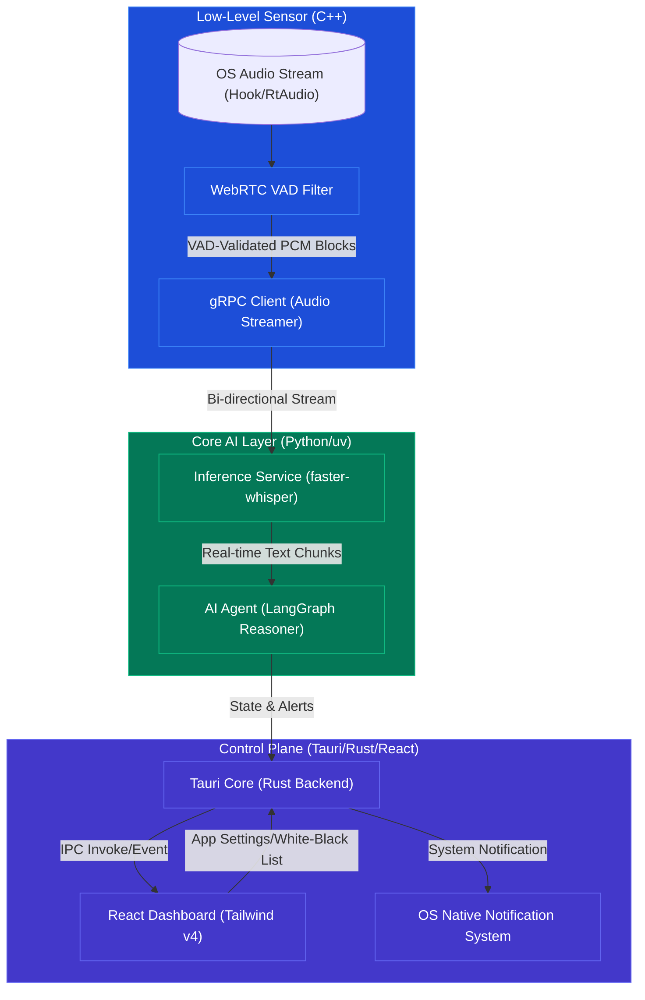

# TrueVoice System Architecture

This document maps out the multi-tier microservices architecture of the TrueVoice platform and defines the data flows, design principles, and gRPC communication contracts. You must maintain these modular boundaries at all times.

---

## 1. System Design Principles

* **Decoupled Architecture**: All services must run independently as separate OS processes and communicate exclusively via gRPC interfaces.
* **Loose Coupling, Strong Contracts**: The `.proto` files are the single source of truth for communication across C++, Python, and Rust/Tauri. No service should directly import or modify another's data structures without a protobuf update.
* **Low Pipeline Latency**: Total pipeline latency from vocal input to threat evaluation must not exceed **5 seconds**. You must optimize IPC, audio chunk sizes, and execution speeds.

---

## 2. Multi-Tier Microservices Topology



---

## 3. Real-Time Data Flow Pipeline

1. **Audio Hooking**: The C++ service captures incoming loopback audio via standard APIs.
2. **Local VAD Processing**: Audio is processed in 10-30ms frames; WebRTC VAD drops frames lacking human speech.
3. **gRPC Streaming**: Valid audio buffers are streamed as gRPC chunks directly to the `inference-stt` Python microservice.
4. **Local Transcription**: The STT engine transcribes the stream in memory into text fragments using a lightweight, locally optimized `faster-whisper` model.
5. **Cognitive Threat Analysis**: The `ai-agent` state machine processes fragments using a sliding context window (last 15 sentences), evaluating semantic cues and checking for trusted entities via NER (Gatekeeper Node).
6. **Tauri IPC Signaling**: State flags, transcriptions, and threat evaluation ratings are dispatched via gRPC to the Tauri dashboard client, triggering immediate visual or system-native notifications.

---

## 4. gRPC Communication Contracts (Single Source of Truth)

All microservices must respect the shared contracts. The primary protobuf interfaces are:

### `AudioStreamer` Interface (Capture ➔ STT)
Streams raw audio chunks from C++ capture logic to Python transcription logic.
```protobuf
syntax = "proto3";

package truevoice.audio;

service AudioStreamer {
  rpc StreamAudio(stream AudioChunk) returns (StreamStatus);
}

message AudioChunk {
  bytes raw_pcm_data = 1;      // Audio payload strictly in RAM
  int32 sample_rate = 2;       // Target sample rate (e.g., 16000)
  int32 channels = 3;          // Channels (mono preferred)
  int64 timestamp_ms = 4;      // Capture epoch
  int32 process_id = 5;        // Host PID opening the stream
}

message StreamStatus {
  bool active = 1;
  string message = 2;
}
```

### `ThreatNotifier` Interface (AI Agent ➔ Tauri Backend)
Dispatches evaluated alerts to the desktop application shell.
```protobuf
syntax = "proto3";

package truevoice.agent;

service ThreatNotifier {
  rpc GetThreatAlerts(Empty) returns (stream ThreatAlert);
  rpc SendControlCommand(ControlCommand) returns (CommandStatus);
}

message Empty {}

message ThreatAlert {
  string matched_text = 1;
  float risk_score = 2;        // Range 0.0 to 1.0
  string threat_category = 3;  // e.g., "Bank Spoofing", "OTP Request"
  string suggested_action = 4;
}

message ControlCommand {
  enum CommandType {
    KILL_STREAM = 0;
    PURGE_MEMORY = 1;
    UPDATE_WHITELIST = 2;
  }
  CommandType type = 1;
  string metadata = 2;
}

message CommandStatus {
  bool success = 1;
}
```
