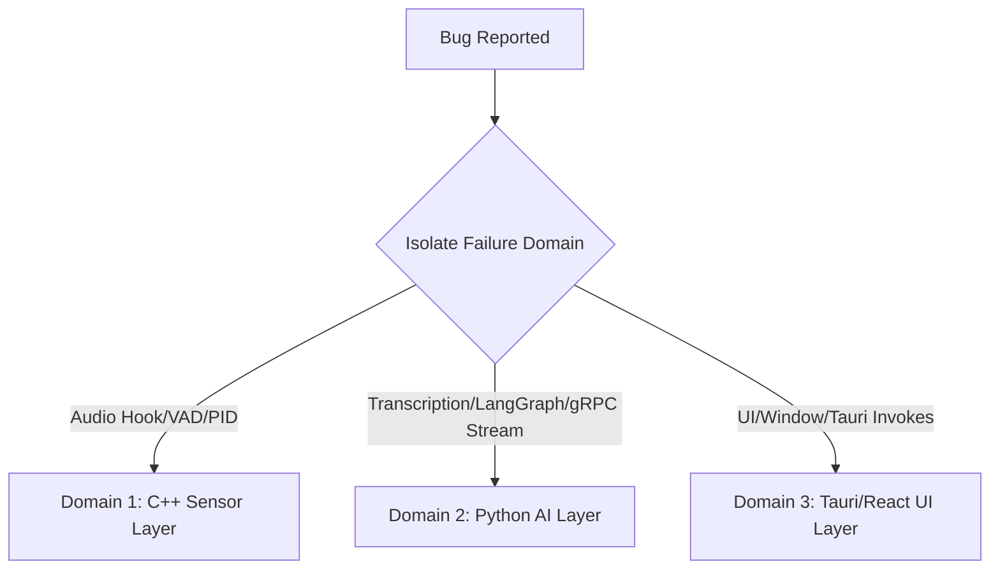

# TrueVoice Debugging Standard Operating Procedure (SOP)

This document contains a step-by-step guide for diagnostic investigations and error isolation. As an AI agent, you must follow this triage sequence to localize and fix bugs across our decoupled system layers.

---

## 1. The Core Triage Sequence

When a system bug is reported (e.g., "threat notifications are not updating in real-time" or "audio capture fails to start"), do not immediately modify code. Instead, isolate the failure to one of the three architectural domains:

---

## 2. Domain 1: Isolate & Debug the C++ Sensor Layer

This layer interacts with hardware drivers (`RtAudio` or `PortAudio`), processes frame loops, and executes local VAD.

### Standard Failure Modes:
* "Audio capture device not found."
* "C++ service crashes with segmentation fault."
* "VAD is dropping valid human speech frames."

### Debugging SOP:
1. **Device Enumeration Test**: Compile and execute a standalone C++ audio diagnostic tool to verify host hardware access and list active capture APIs (ASIO, WASAPI, CoreAudio).
2. **WebRTC VAD Check**: Isolate VAD filtering by running raw PCM stream outputs through a diagnostic test. Ensure your frame size parameters are strictly 10ms, 20ms, or 30ms with sample rates of 8000Hz, 16000Hz, 32000Hz, or 48000Hz (required by WebRTC VAD).
3. **PID Validation**: Log the extracted process IDs during hook execution to verify that blocklist/whitelist logic is receiving correct OS process identifiers.

---

## 3. Domain 2: Isolate & Debug the Python AI & gRPC Layers

This layer transcribes PCM audio and evaluates threat states with LangGraph.

### Standard Failure Modes:
* "gRPC stream connection rejected or dropped."
* "Local model fails to load in memory."
* "LangGraph gets stuck in infinite loops or fails to process state transitions."

### Debugging SOP:
1. **gRPC Interface Verification**: Test loopback interface configurations. Run a simple Python gRPC client-server ping script using the generated protobuf interfaces to determine if loopback ports (e.g., `50051`) are blocked by local firewalls.
2. **Model Loading Sanity Check**: Run `uv run main.py` directly inside `services/inference-stt` to inspect startup tracebacks. Ensure the path configured for the local `faster-whisper` model exists and that the system has sufficient VRAM/RAM.
3. **LangGraph State Tracer**: Log state updates on every state-transition node. Inspect the sliding window array (last 15 sentences) to ensure old memory nodes are evicted correctly and that the Gatekeeper NER node triggers clean exits.

---

## 4. Domain 3: Isolate & Debug the Tauri & React UI Layer

This layer acts as the control plane presentation layer.

### Standard Failure Modes:
* "Tauri IPC commands fail to communicate with Rust backends."
* "Native OS notifications do not trigger."
* "Dashboard displays stale or unpopulated threat metric data."

### Debugging SOP:
1. **Webview Inspector**: Run Tauri in development mode with the Webview DevTools enabled. Right-click and inspect the React component state, console logs, and Vite bundle compilation warnings.
2. **Tauri Command Auditing**: Verify that commands declared in `src-tauri/src/main.rs` are registered inside `tauri::Builder::default().invoke_handler(tauri::generate_handler![...])`.
3. **Event Stream Auditing**: Check if Tauri event listeners on the frontend match the exact naming conventions dispatched by the Rust core or gRPC callbacks.

---

## 5. Universal Debug Checklist for AI Agents

* Always check the local environment configurations (.env.development, .env.production).
* Inspect build logs in the `.github/workflows/` runner history if a platform-specific compile fails.
* Ensure you do not add `print` statements in critical performance paths; utilize standard logging frameworks with correct log levels (`DEBUG`, `INFO`, `WARNING`, `ERROR`).
